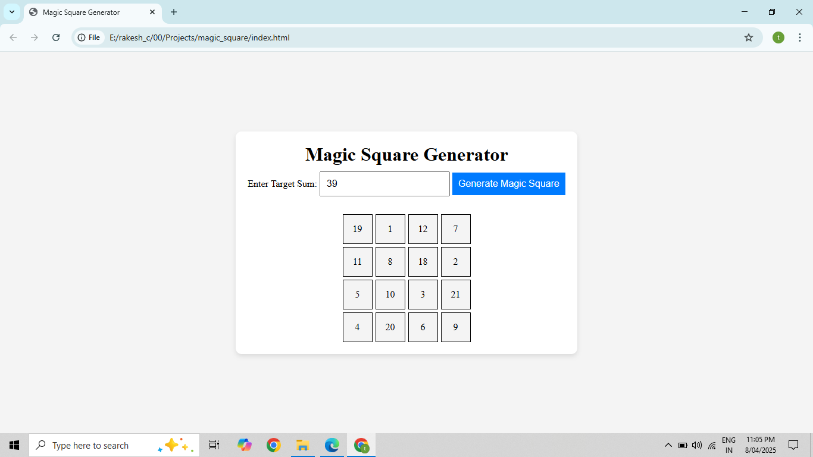

# 🔢 4x4 Magic Square Generator

A web-based tool to dynamically generate **4x4 Magic Squares** where the sum of all rows, columns, and diagonals equals a target value greater than 34.

---

## 🌟 Features

- ✅ Generates valid 4x4 magic squares dynamically.
- 🧮 Ensures all rows, columns, and diagonals have equal sums.
- 💻 User-friendly interface for easy interaction.
- ⚙️ Real-time updates based on user input.

---

## 📸 Preview

 

---

## 🛠️ Technologies Used

- **HTML** 
- **CSS** 
- **JavaScript** 

---

## 🚀 How to Use

1. Clone or download this repository.
2. Open the `index.html` file in your browser.
3. Enter a target sum (must be ≥ 34).
4. Click **Generate Magic Square**.
5. View the updated 4x4 magic square.

---

## 📬 Contact

Feel free to connect if you have suggestions or want to collaborate.

---

## 📄 License

This project is open source and available under the [MIT License](LICENSE).

